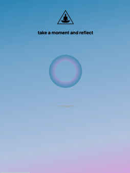
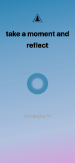

Try me
[here](https://meditation-iota.vercel.app/)

This project is powered by:
[Next.js](https://nextjs.org/)
[TypeScript](https://www.typescriptlang.org/)

Examples of this web abb in production:
<p align="center">
  
  
  
</p>


## Getting Started

First, run the development server:

```bash
npm run dev
# or
yarn dev
```
